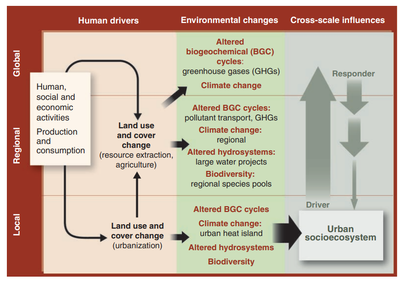

Unprecedented urbanization is impacting people and the planet from local to global scales,m specially in developing countries. As of 2023, urbanization in India is around 35% and expected to accelerate to 50% by 2050. Therefore, we have a unique chance to develop resilient, sustainable, healthy, livable and equitable urban future.

Our lab researches geospatial techniques (Geo) for studying Human-Urban-Environment Systems (HUES) from local to global scales. Our research intersects the multidisciplinary fields of satellite remote sensing and GIS technology along with human-environment interactions. We connect cities to surrounding earth systems to mitigate extreme heat, GHG emissions and pollution. We are concerned with how geospatial technologies can be used for understanding the anthropogenic environmental impacts (and vice-versa) through changes in land-use land-cover, environment and socio-economic health, and using it to devise evidence-based engineering policy suggestions. 

Our key research areas are land use and land cover (LULC) and change, urban vertical structure, urban heat islands, infrastructure health, energy use and emissions, air and water quality, carbon budgets, and green space.

    

Figure 1. Framework showing interaction between human induced urban socioecosystem driving and bein driven by environmental changes. Socio-econonomic development/expansion land changes (e.g. urbanization) leads to alterations of biogeochemical cycles, climate, hydrosystems, and biodiversity at various spatio-temporal scales. Image is reproduced from Grimm, N. B., Faeth, S. H., Golubiewski, N. E., Redman, C. L., Wu, J., Bai, X., & Briggs, J. M. (2008). Global change and the ecology of cities. science, 319(5864), 756-760.

Prospective researchers
------
We are always looking for motivated graduate and undergraduate students, postdocs, and visiting scholars to join our team. If interested, please email to prakhar.misra[at]ce.iitr.ac.in . 

