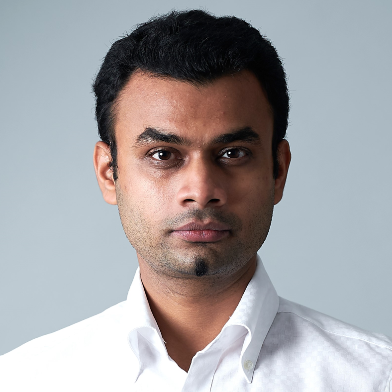
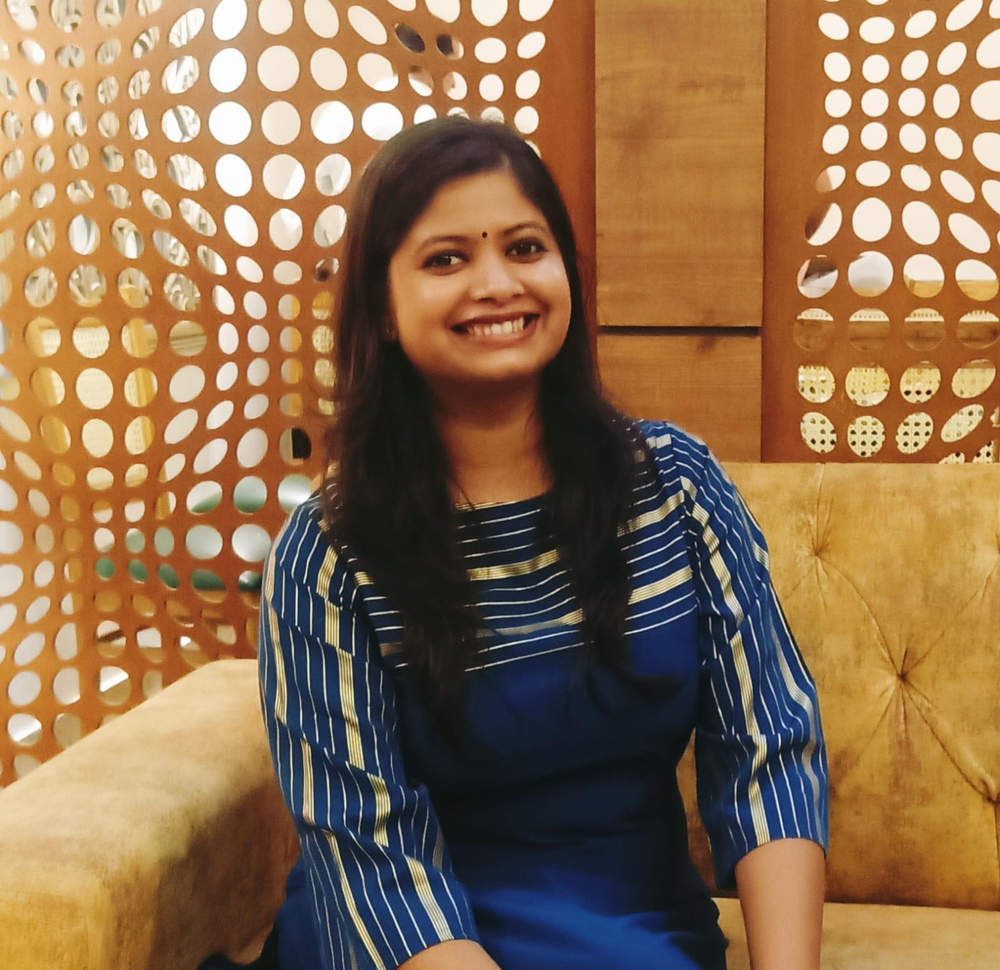
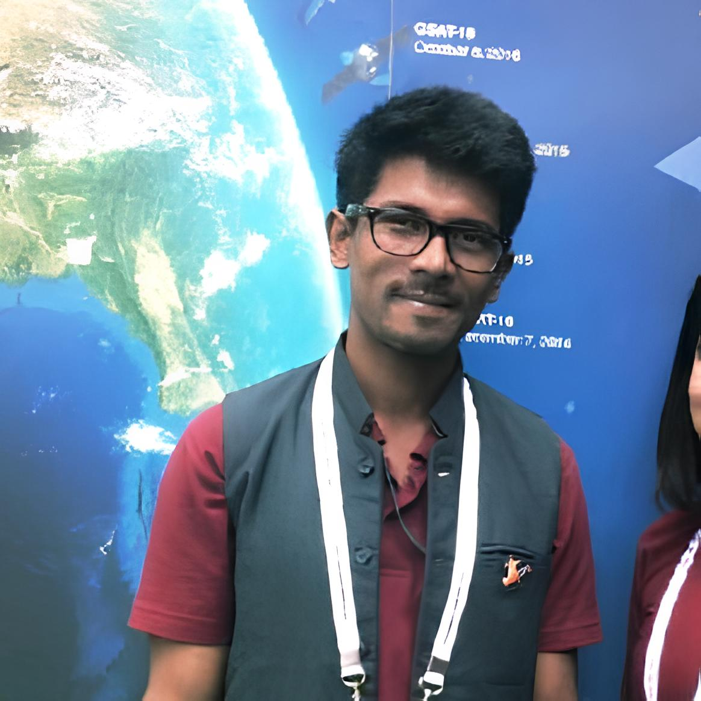
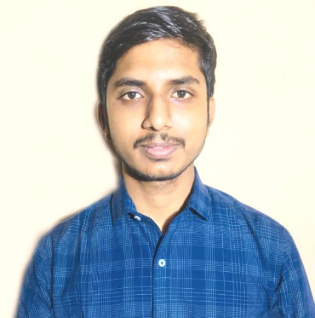
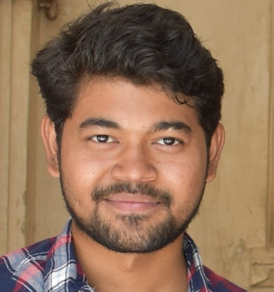
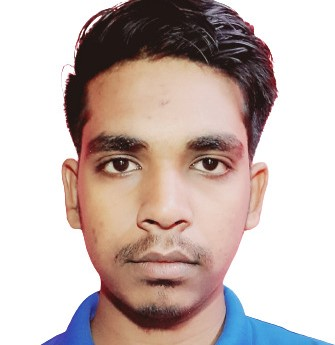

## Faculty/staff 

 <!-- Faculty/staff  -->
 
 

 <table width="100%">
   <tbody>
      <tr>
         <td width="26%"></td>
         <td width="74%" class="papertext">
            
<strong>Prakhar Misra</strong>

            
 I am currently Assistant Professor in the Geomatics Group, Department of Civil Engineering at Indian Institute of Technology, Roorkee and lead the GeoHUES lab. My research interests lie in studying the urban environmental (such as anthropogenic emissions) issues emanating from socio-economic growth in developing countries by using satellite retrieved air pollution, and land-use datasets, GIS and other sensors. My goal is end-to-end remote sensing evidence and scenario based policy framework for mitigating eco-health impact.

            
I am a big supporter for walkable cities, and enthusiastic about photography and long-distance cycling. My hometown is Lucknow, Uttar Pradesh

            
Email: prakhar.misra[at]ce.iitr.ac.in 

         </td>
      </tr>
   </tbody>
 </table> 
 

## Current PhD students
 <!-- PhD Student  -->
   
 

   <table width="100%">
   <tbody>
      <tr>
         <td width="26%"></td>
         <td width="74%" class="papertext">
            
<strong>Pallavi Chaurasia (2023~)</strong>

            
Research Theme: Urban heat island and Urban air quality interactions

            
Email: pallavi_c[at]ce.iitr.ac.in 

            
Background:  M.Tech. (Geomatics),  NIT Warangal 

            
Hobbies: Travel, Dance, Reading Books 

         </td>
      </tr>
      <tr>
         <td width="26%"></td>
         <td width="74%" class="papertext">
            
<strong>Kunal Bansal (2023~)</strong>

            
Research Theme: 3 dimensional urbanization and decarcbonization

            
Email: kunal_b[at]ce.iitr.ac.in 

            
Background: M.Tech. (Geomatics) , IIT Roorkee 

            
Hobbies: Swimming, Singing, Biography movies  

         </td>
      </tr>
      <tr>
         <td width="26%"></td>
         <td width="74%" class="papertext">
            
<strong>Ravi Kant (2024~)</strong>

            
Research Theme: TBA

            
Email: ravi_k[at]ce.iitr.ac.in 

            
Background: M. Tech. (Remote Sensing and GIS), IIRS Dehradun 

            
Hobbies: Table Tennis, Chess and Photography

         </td>
      </tr>
   </tbody>
 </table> 
 

## Current Masters students
 <!-- Master Student  -->
   
 

   <table width="100%">
   <tbody>
      <tr>
         <td width="26%"></td>
         <td width="74%" class="papertext">
            
<strong>Sarvjeet Kumar (2022~)</strong>

            
Research Theme: Farm abandonment in Himalayan cities villages

            
Email: sarvjeet_k[at]ce.iitr.ac.in 

            
Background: B.Tech. (Civil Enginnering), NSUT west campus 

            
Hobbies: Swimming, Travelling 

         </td>
      </tr>
      <tr>
         <td width="26%"></td>
         <td width="74%" class="papertext">
            
<strong>Sayeed Anwar (2023~)</strong>

            
Research Theme: Air pollution

            
Email: sayeed_a[at]ce.iitr.ac.in 

            
Background: Bachelor of Planning, SPA Bhopal 

            
Hobbies: Swimming, Table Tennis, Badminton, Photography 

         </td>
      </tr>
      <tr>
         <td width="26%"></td>
         <td width="74%" class="papertext">
            
<strong>Avinash Mehta (2023~)</strong>

            
Research Theme: Brick Kiln

            
Email: avinash_m[at]ce.iitr.ac.in 

            
Background: B.Tech. (Civil Engineerig), RSR RCET Bhilai 

            
Hobbies:  Martial Arts, Travelling, Sci-fi movies 

         </td>
      </tr>
   </tbody>
 </table> 
 

## Internship student
 <!-- Intenship Student  -->
 
 

 <table width="100%">
   <tbody>
      <tr>
         <td width="26%"></td>
         <td width="74%" class="papertext">
            
<strong>Aravind S (2024/3~2024/5)</strong>

            
Research Theme: Air quality in urbanizing regions 

            
Email: aravindmario[at]gmail[dot]com 

            
Background: MSc Geogrpahy II year student at Central University of Punjab 

         </td>
      </tr>
   </tbody>
 </table> 
 

<!---
* Sumesh T.A., jointly with Prof. Phalguni Gupta <i>Open Seminar Done</i>
* Prem Raj, jointly with Prof. Behera
-->

<!---
## List of current Master's students
* Niharika Ahuja
* Aman Deep Singh
* Harikrishnan Balagopal
* Saisha
* Sidharth Singla
* Sumit Kumar
* Gunjan Govind Kolhapure
* Sristi Jaiswal
* Nitish Mangesh Kalan
* Abhimanyu
* Nikhil Ghantudiya
* Hemant Parihar
* Deepankar Srivastava
* Parul Kapoor
-->

<!---
## List of completed PhD students
* Arshad Jamal, jointly with Prof. K.S. Venkatesh and Dr. Deepti Deodhare
   * Thesis Title: <i>Recognizing Activities Under Domain Shift</i>
   * PhD Thesis: submitted for review August 2019
   * PhD Thesis: Defended 18th January 2020
* Badri Patro
   * Thesis Title: <i>Towards Understanding Vision and Language Systems: Controllability, Uncertainty and Interpretability for VQA and VQG</i>
   * PhD Thesis: submitted for review December 2019
   * PhD Thesis: Defended 10th August 2020
* Pravendra Singh
   * Thesis Title: <i>Efficient Methods for Deep Learning</i>
   * PhD Thesis: submitted for review April 2020
   * PhD Thesis: Defended 4th November 2020
* Vinod Kumar Kurmi, jointly with Prof. K.S. Venkatesh
   * Thesis Title: <i> Understanding Transfer Learning between Domains and Tasks </i>
   * PhD Thesis: submitted for review: July 2020
   * PhD Thesis: Defended 6th December 2020
* Pratik Mazumder, jointly with Dr. Piyush Rai
* B.V. Raghav
* Ravindra Yadav, jointly with Prof. Rajesh Hegde
-->

<!---
## List of completed Master's students
* Kalyanasundaram, Karthick
   * Thesis Title: <i>Active Learning for Visual Object Recognition</i>
   * Graduation Year - 2015
* Mahmood Mohammad
   * Thesis Title: <i>Novel Methods for Image Inpainting</i>
   * Graduation Year 2015
* Rahul Arora, guided jointly with Dr. Adrien Bousseau
   * Thesis Title: <i>Exploring Design Space by Interpolating between Multiple Sketches</i>
   * Graduation Year 2015
* Sachin Kumar Yadav
   * Thesis Title <i> Understanding actions and genres in videos</i>
   * Graduation Year 2015
* Chandra Prakash
   * Thesis Title: <i> Computing disparity from stereo image pair</i>
   * Graduation Year 2015
* Subhabrata Debnath
   * Thesis Title: <i> Robust detection in presence of hard examples</i>
   * Graduation Year 2015
* Anjan Banerjee
   * Thesis Title: <i>Self Learning for Object Detection</i>
   * Graduation Year 2015
* Subhashish Saha
   * Thesis Title: <i>Bangla Text Segmentation in Wild</i>
   * Graduation Year 2015
* Ritesh Jha, jointly with Dr. Subhajit Roy
   * Thesis Title: <i>Inferring long frequent program paths from partial information</i>
   * Graduation Year 2015
* Nikhil Kumar, jointly with Prof. K.S. Venkatesh
   * Thesis Title: <i>Regularity Flow Inspired Target Tracking in FLIR Imagery</i>
   * Graduation Year 2015
* Guddu Kumar
   * Thesis Title: <i>CUDA based approach for computing disparity from stereo image pair</i>
   * Graduation Year 2015
* Nikhil Jamdade, jointly with Prof. Manindra Agrawal
   * Thesis Title: <i>DrawN: An Interactive System for Freehand Sketching and Sketch Based Retrieval of 3D Object</i>
   * Graduation Year 2015
* Adarsh Chauhan
   * Thesis Title: <i> Active Transfer Learning for Image Recognition using ConvNets</i>
   * Graduation Year - 2016
* Ayush Mittal
   * Thesis Title: <i>Domain Adaptation in the Wild</i>
   * Graduation Year - 2016
* Samrath Patidar 
   * Thesis Title: <i>Subspace Based Adaptation of Detectors for Video</i>
   * Graduation Year - 2016
* Yeshi Dolma
   * Thesis Title: <i>Using Gaussian Processes to Improve Zero-Shot Learning with Relative Attributes</i>
   * Graduation Year - 2016
* Vinit Tiwari, jointly with Prof. Amitabha Mukerjee
   * Thesis Title: <i>Exploring Pose Manifold and its evaluation in synthetic robotic pose and real world human pose</i>
   * Graduation Year - 2016
* Sharin K.G. 
   * Thesis Title: <i>Discovering Mid-Level Visual Sub Categories</i>
   * Graduation Year - 2016
* Rajat Kumar Verma
   * Thesis Title: <i>Improvement of Depth Map Using Segmentation and Occlusion Inpainting</i>
   * Graduation Year - 2016
* Ishan Darolia
   * Thesis Title: <i>Automated Relighting of Sketches</i>
   * Graduation Year - 2016
* Unnat Jain
   * Thesis Title: <i>Supervised Hashing for Robust Visual Place Recogniton</i>
   * Graduation Year - 2016
* Arpit Jangid, jointly with Prof. K.S. Venkatesh
   * Thesis Title: <i>Visual odometry based hyperlapse creation</i>
   * Graduation Year - 2016
* Rahul Sankhwar, jointly with Prof. K.S. Venkatesh
   * Thesis Title: <i>Visual Hull Reconstruction in Surveillance Videos</i>
   * Graduation Year - 2016
* Soumya Roy
   * Thesis Title: <i>Active learning for object detection using Structured SVM</i>
   * Graduation Year - 2016
* Devendra Mandan
   * Thesis Title: <i>Image Popularity Prediction in Social Media using Convolutional Neural Networks</i>
   * Graduation Year - 2016
* Aishwarya Jadhav, jointly with Prof. K.S. Venkatesh
   * Thsis Title: <i>Deep Face Recognition In Scarce Data Scenario</i>
   * Graduation Year - 2016
* Chirag Kataria
   * Thesis Title: <i>Localized Instance Retrieval Of Clothing Items</i>
   * Graduation Year - 2017
* Shishir Mathur
   * Thesis Title: <i>Lip movement Synthesis from Text</i>
   * Graduation Year 2017
* Samik Some
   * Thesis Title: <i>A Tag-based Approach to Video Captioning</i>
   * Graduation Year 2017
* Prabuddha Chakraborty
   * Thesis Title: <i>Coarse Pose Estimation Using Deep Learning Without Manual Supervision</i>
   * Graduation Year 2017
* Kundan Kumar, jointly with Prof. Yoshua Bengio
   * Thesis Tile: <i>Learning Long Term Structure in Auto-regressive Models</i>
   * Graduation Year 2017
* Vamsi Krishna Donthu
   * Thesis Title: <i>Reconstruction for One Shot Face Recognition</i>
   * Graduation Year 2017
* Debjeet Majumdar
   * Thesis Title: <i>Unsupervised Domain Adaptation of Deep Object Detectors</i>
   * Graduation Year 2017
* Ayushman Sisodiya
   * Thesis Title: <i>Spatio-Temporal Attention For Video Description</i>
   * Graduation Year 2017
* Raunak Shamnani
   * Thesis Title: <i>Image Caption Using Emotion Ratings From Facebook Data</i>
   * Graduation Year 2017
* Rohit Gupta
   * Thesis Title: <i>Video description by learning to detect visual tags</i>
   * Graduation Year 2017
* Soumik Dasgupta
   * Thesis Title: <i>Dynamic Attention Networks for Task Oriented Language Grounding</i>
   * Graduation Year 2018
* Utkarsh Chauhan 
   * Thesis Title: <i>Unsupervised Domain Adaptation using Adversarial Learning	Chauhan</i>
   * Graduation Year 2018
* Vishak Prasad C,
   * Thesis Title: <i>Learning Feature Disentanglement Using InfoVAE</i>
   * Graduation Year 2018
* Subhadip Nandi
   * Thesis Title: <i>Adversarial Tracking</i>
   * Graduation Year 2018
* Aditi Patil
   * Thesis Title: <i>Visual Representation Learning using Self-Supervision and Adversarial Networks</i>
   * Graduation Year 2018
* Sneha Kola
   * Thesis Title: <i>Visual Search and Virtual Try-on For E-Commerce</i>
   * Graduation Year 2018
* Akanksha Gupta
   * Thesis Title: <i>Diverse Caption Generation and Comparative Study of Caption Generation</i>
   * Graduation Year 2018
* Ankita Bishnu
   * Thesis Title: <i>Semi Supervised Grounding of Phrases in Images</i>
   * Graduation Year 2018
* Ravi Teja Palepu
   * Thesis Title: <i>Unsupervised Multimodal Representation Learning</i>
   * Graduation Year 2018
* Rajat
   * Thesis Title: <i>Active Learning for Multi-Label Classification using WSL Models</i>
   * Graduation Year 2019
* Shubham Jain, jointly with Dr. Ketan Rajawat
   * Thesis Title: <i>Decision-Based Object Tracking using Generic Object Tracker and Detector</i>
   * Graduation Year 2019
* Aadil Hayat
   * Thesis Title: <i>Towards Diversified Reinforcement Learning</i>
   * Graduation Year 2019
* Vivek Gupta
   * Thesis Title: <i>VQuAD: Pursuing Diagnostic for Video Question Answering</i>
   * Graduation Year 2019
* Sanket Gandhi 
   * Thesis Title: <i>Uncertainty Estimation For Medical Image Segmentation</i>
   * Graduation Year 2019
* Abhishek Joshi 
   * Thesis Title: <i>Abnormal Activity Detection in Videos</i>
   * Graduation Year 2019
* Blessen George
   * Thesis Title: <i>Probabilistic Generative Adversarial Modelling</i>
   * Graduation Year 2019
* Prateek Samaiya
   * Thesis Title: <i>Autonomous drone navigation with collision avoidance using reinforcement learning</i>
   * Graduation Year 2019
* Agrim Bansal
   * Thesis Title: <i>Learning Cooperative and Competitive Skills in Multi-Agent Reinforcement Learning using Self-Play</i>
   * Graduation Year 2019
* Asim Unmesh
   * Thesis Title: <i>Active Learning for Image Classification</i>
   * Graduation Year 2019
-->