 <!-- News  -->

 

   <table width="100%">
   <tbody>
      <tr>
         <td width="15%">
<dt>2024 May 22</dt>
</td>
         <td width="85%" class="papertext">
            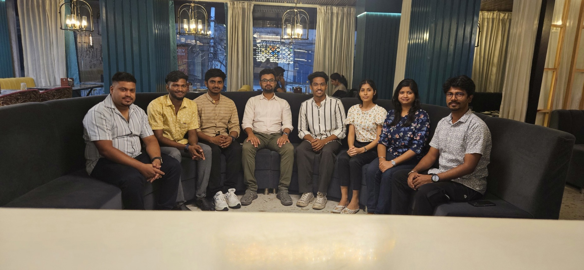
            
We held a party to celebrate Sarvjeet defending his MTech thesis, completion of Aravind's internship and welcoming the new internship students, Himani (Department of Architecture and Planning, IIT Roorkee) and Firose (Department of Geoinformatics, Bharathidasan University). 

         </td>
      </tr>
      <tr>
         <td width="15%">
<dt>2024 May 17</dt>
</td>
         <td width="85%" class="papertext">
            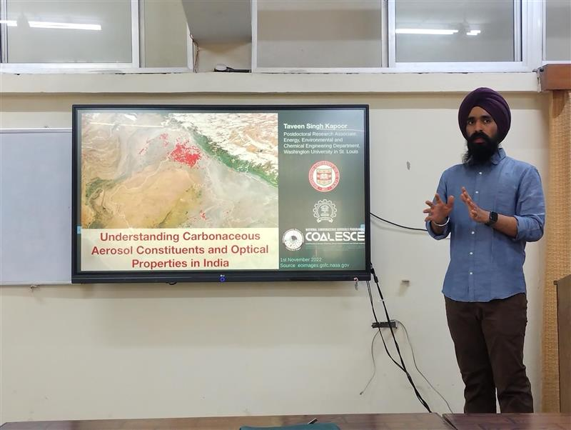
            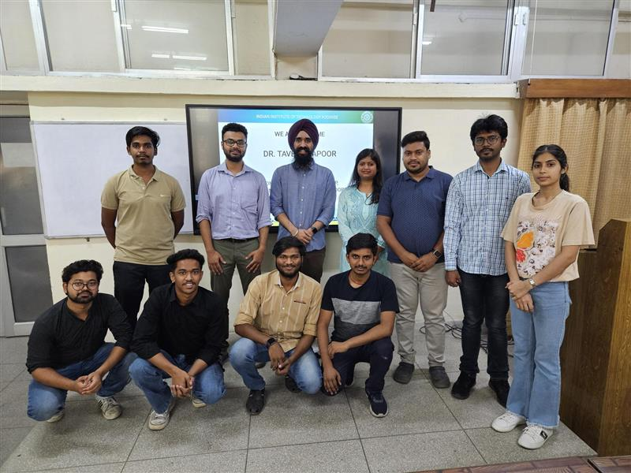
            
Dr. Taveen Kapoor (sites.google.com/view/taveensk), post-doctoral researcher at Washington University in St Louis kindly visited our lab. He presented on "Understanding Carbonaceous Aerosol Constituents and Optical Properties in India". Lab members presented their research topics to him and received candid advice. 

         </td>
      </tr>
      <tr>
         <td width="15%">
<dt>2024 Mar. 11</dt>
</td>
         <td width="85%" class="papertext">
            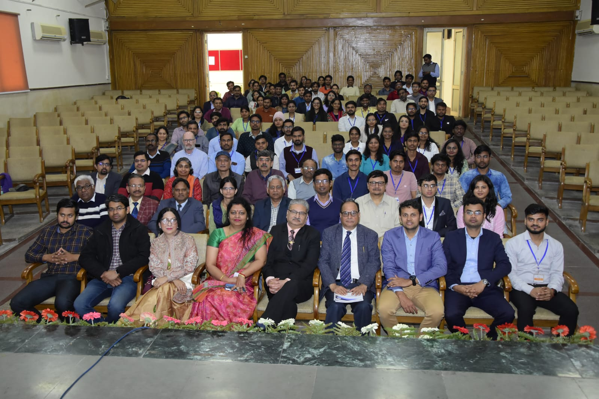
            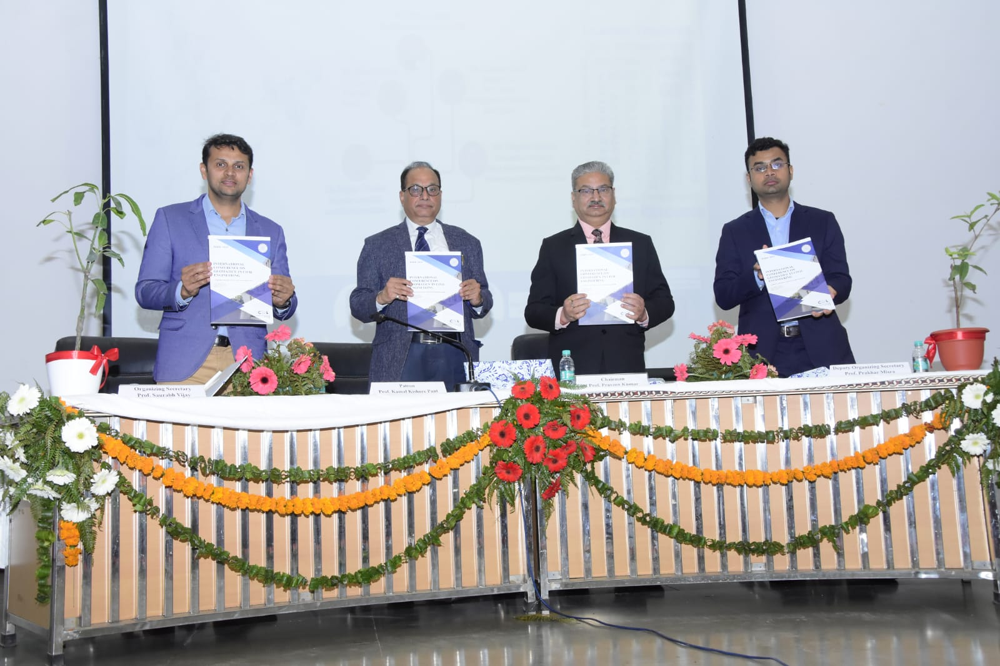
            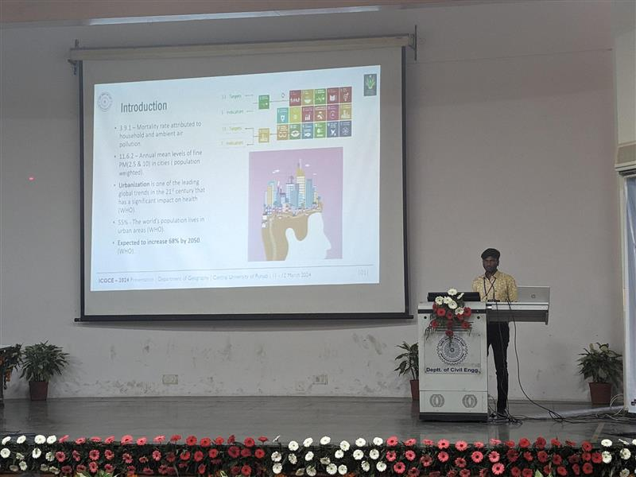
            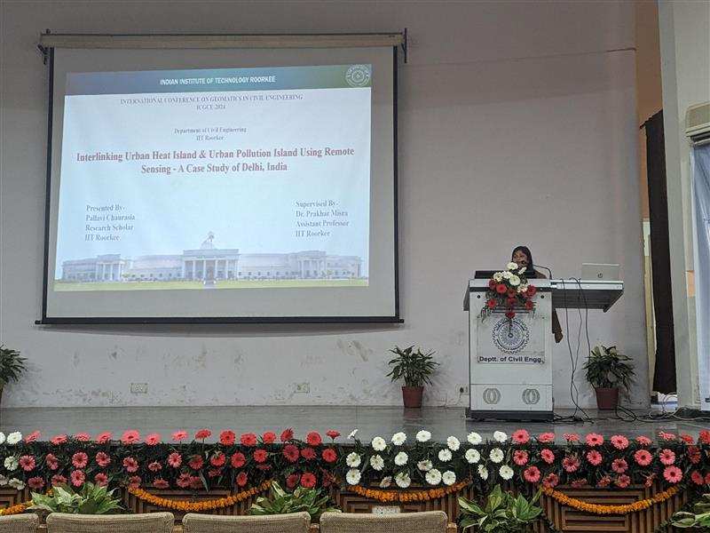
            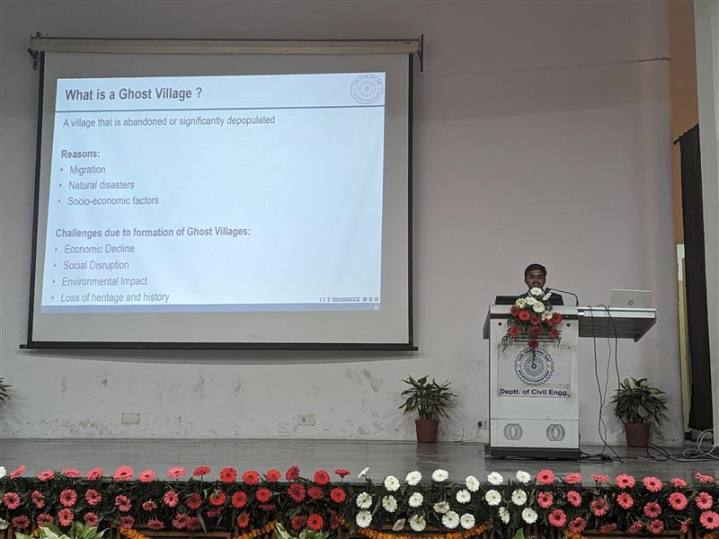
            
International Conference on Geomatics in Civil Engineering 2024 (https://icgce-2024.iitr.ac.in/) was organized successfully, thanks to support of the MTech students. About 50 papers were presented through oral/posters. Pallavi, Sarvjeet and Aravind also presented their works and received feedback. 

         </td>
      </tr>
      <tr>
         <td width="15%">
<dt>2024 Feb. 01</dt>
</td>
         <td width="85%" class="papertext">
            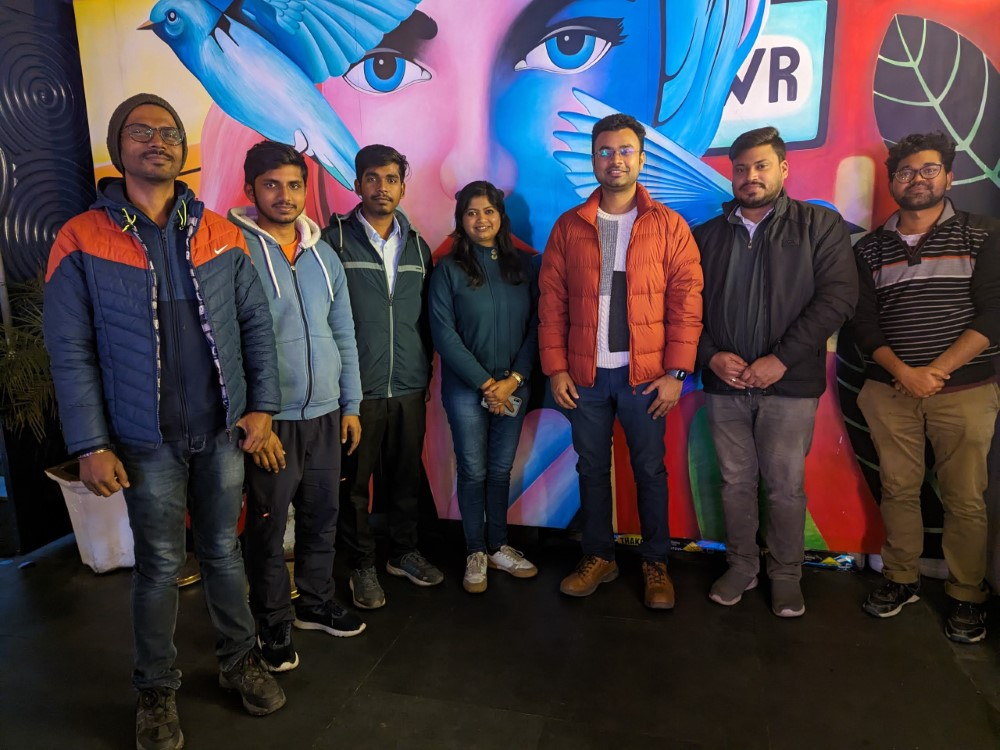
            
We enjoyed introduction seminar and a new year dinner party together!

         </td>
      </tr>
      <tr>
         <td width="15%">
<dt>2024 Jan. 01</dt>
</td>
         <td width="85%" class="papertext">
            
2 Global Patents awarded to our work "GROUND MOVEMENT ANALYSIS DEVICE AND GROUND MOVEMENT ANALYSIS METHOD", a ground deformation early warning systems using InSAR processing framework. It was developed at Synspective Inc. while working to identify the precursors of a major glacial lake outburst flood disaster in Nepal. We look forward to doing more solutions with your support.

            
The patents can be viewed at: 
            <a href="https://patents.google.com/patent/WO2024004215A1/ja?oq=PCTJP2022026506">[PCTJP2022026506]</a>
            <a href="https://patents.google.com/patent/WO2024004216A1/ja?oq=PCTJP2022026508">[PCTJP2022026508]</a>

         </td>
      </tr>
      <tr>
         <td width="15%">
<dt>2023 Sep. 18</dt>
</td>
         <td width="85%" class="papertext">
            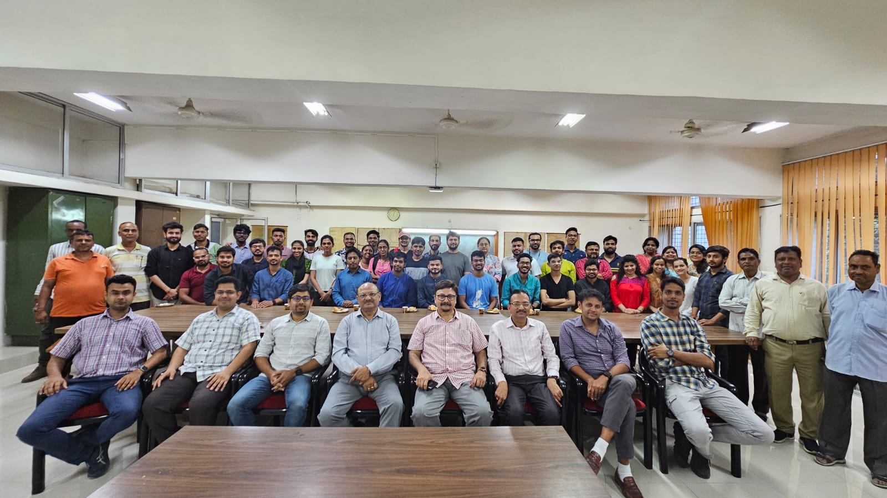
            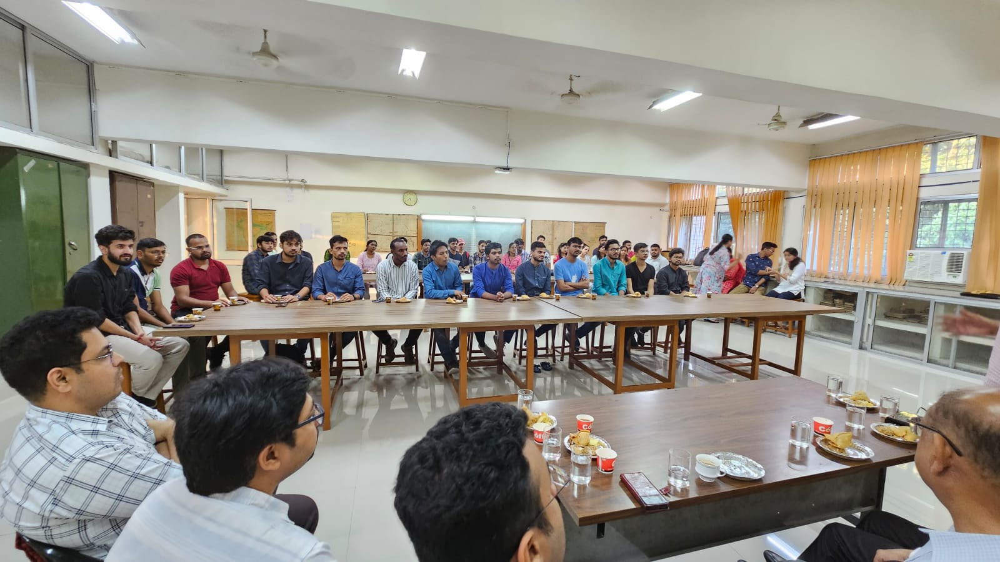
            
Welcome and interactions with new and senior students at the Geospatial Engineering Group

         </td>
      </tr>
   </tbody>
 </table> 
 
