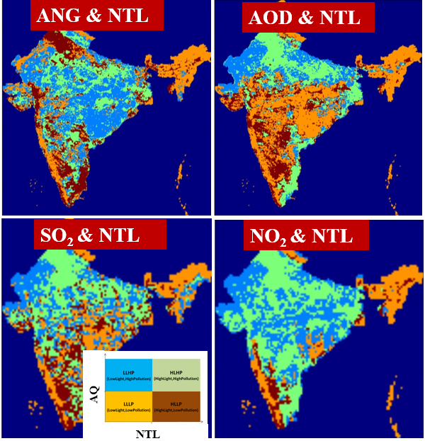

 
 
 At the **GeoHUES lab** we develop and exploit environmental remote sensing and geospatial techniques for investigating human-environment interactions pertaining to the nexus of land-use activities, environment and human impacts. We investigate driving mechanisms of land-use change and consequence of land-use changes on the environment. This involves characterizing spatio-temporal urban-rural land-use morphology, developing dynamic top-down and bottom-up air pollution emission inventories, and assessing human health impacts as shown in Figure 1. A portion of research is also dedicated towards infrastructure monitoring. 

   

 
 
Our research spans multiple data modalities such as space-borne optical and SAR sensors, UAV-borne sensors, low-cost air quality monitoring sensors and social sensing with process-based models. Our research includes following main themes:
1. Land-use change: What are the characteristics of volumetric urban growth, building functions as well as rural land-use change? How are these shaped by socio-economic drivers?
2. Environmental impact: What are the variations of fine aerosol and trace gas concentrations and emissions over spatial scales ranging from urban/rural to regional, and temporally from diurnal to seasonal? How do physical land-processes determine tropospheric composition and air quality? 
3. Health impacts: What environmental and socio-economic factors influence individual exposure and vulnerability? How can we model individual acute and chronic exposure and impacts by combining satellite and portable sensors measurements?
4. Infrastructure monitoring: What is the impact of environment on infrastructure health and safety?  

Direction 1. Characterizing urban-rural land-use changes 
===

    

 <!-- Direction 1 Urban land-use  -->
 
 

 <table width="100%" border="0">
   <tbody>

<tr>
    <td width="32%"></td>
    <td width="68%">
<strong>
    Identification of Brick Kilns using Sentinel-2 Imagery</strong> 
    <strong>Prakhar Misra</strong>, Ram Avtar Group, Sachiko Hayashida, Wataru Takeuchi   
    <a href="https://www.mdpi.com/2220-9964/9/9/544">[Paper]</a>  
</td>
    <td>&nbsp;</td>
</tr>

<tr>
    <td width="32%"></td>    
    <td width="68%">
<strong>
    Identification of Conformity of Urban Land-use to Zoning Regulations</strong> 
    <a href="https://ramenvjnu.wixsite.com/mysite">Ram Avtar Group</a>, <strong>Prakhar Misra</strong>,   
    <a href="https://link.springer.com/article/10.1007%2Fs11625-021-00923-0">[Paper]</a>  
</td>
    <td>&nbsp;</td>
</tr>

<tr>
    <td width="32%"></td>    
    <td width="68%">
<strong>
    Mapping Impact of Building-density and Building height on Urban Heat Island</strong> 
    <a href="https://ramenvjnu.wixsite.com/mysite">Ram Avtar Group</a>, <strong>Prakhar Misra</strong>,   
    <a href="https://www.mdpi.com/2072-4292/12/7/1191">[Paper]</a>  
</td>
    <td>&nbsp;</td>
</tr>

<tr>
    <td width="32%"></td>    
    <td width="68%">
<strong>
    Mapping Urban Land-use using Building Height and Nighttime Light</strong> 
    <strong>Prakhar Misra</strong>, Wataru Takeuchi  
    <a href="https://www.researchgate.net/publication/333916547_A_NOVEL_TECHNIQUE_FOR_ESTIMATING_EXPANSION_OF_RESIDENTIAL_COMMERCIAL_AND_INDUSTRIAL_REGIONS_IN_INDIAN_MEGACITIES">[ResearchGate]</a> <a href="https://prakhar.users.earthengine.app/view/urban-morphology---ludhiana">[GEE]</a> 
</td>
    <td>&nbsp;</td>
</tr>

<tr>
    <td width="32%"></td>    
    <td width="68%">
<strong>
    Digital Building Height extraction from open Digital Surface Models </strong> 
    <strong>Prakhar Misra</strong>, Ram Avtar, Wataru Takeuchi  
    <a href="https://www.mdpi.com/2072-4292/10/12/2008">[Publication]</a> <a href="https://github.com/mprakhar/DSM2DTM">[Github]</a> <a href="https://prakhar.users.earthengine.app/view/urban-morphology---ludhiana">[GEE App]</a> 
</td>
    <td>&nbsp;</td>
</tr>

<tr>
    <td width="32%"></td>    
    <td width="68%">
<strong>
    Identification of Rice-crop Calendar </strong> 
    H.V. Minh, <a href="https://ramenvjnu.wixsite.com/mysite">Ram Avtar Group</a>, <strong>Prakhar Misra</strong> 
    <a href="https://www.mdpi.com/2220-9964/8/5/211">[Paper]</a> 
</td>
    <td>&nbsp;</td>
</tr>

<tr>
    <td width="32%"></td>
    <td width="68%">
<strong>
    Clustering by Nighttime light and Air Pollution </strong> 
    <strong>Prakhar Misra</strong>, Wataru Takeuchi  
    <!--<a href="https://www.mdpi.com/2072-4292/10/12/2008">[Publication]</a> <a href="https://github.com/mprakhar/DSM2DTM">[Github]</a> <a href="https://prakhar.users.earthengine.app/view/urban-morphology---ludhiana">[GEE App]</a> 
        -->
    
</td>
    <td>&nbsp;</td>
</tr>
</tbody></table> 
 

Direction 2. Modelling bottom-up and top-down environmental impacts
===

 
<!-- Direction 2 Environmental impacts  -->

 

<table width="100%" border="0">
  <tbody>

<tr>
    <td width="32%"></td>
    <td width="68%">
<strong>
    Top-down NOx Emission estimation with special focus on COVID-locakdown  </strong> 
    <strong>Prakhar Misra</strong>, <a href="https://aakash-rihn.org/">Project Aakash</a>, Sachiko Hayashida  
    <a href="https://www.nature.com/articles/s41598-021-87673-2">[Paper]</a>   
</td>
    <td>&nbsp;</td>
</tr>

<tr>
    <td width="32%"></td>    
    <td width="68%">
<strong>
    Urban Air Quality (PM2.5) Indicator using Aerosol Optical Depth  </strong> 
    <strong>Prakhar Misra</strong>, Aya Fujikawa, Ryoichi Imasu, Wataru Takeuchi  
    <a href="http://www.mdpi.com/2072-4292/9/8/851">[Paper]</a>   
</td>
    <td>&nbsp;</td>
</tr>

<tr>
    <td width="32%"></td>
    <td width="68%">
<strong>
    Contribution by  Land-use types to Urban Air Pollution</strong> 
    <strong>Prakhar Misra</strong>, Ryoichi Imasu, Wataru Takeuchi   
    <a href="https://link.springer.com/article/10.1007%2Fs11625-021-00923-0">[Paper]</a>  
</td>
    <td>&nbsp;</td>
</tr>

<tr>
    <td width="32%"></td>
    <td width="68%">
<strong>
    Emission Inventory of Ho Chi Minh City </strong> 
    Nguyen trang, <strong>Prakhar Misra</strong>, Wataru Takeuchi  
    <a href="https://acp.copernicus.org/articles/21/2795/2021/">[Paper]</a> 
</td>
    <td>&nbsp;</td>
</tr>

<tr>
    <td width="32%"></td>
    <td width="68%">
<strong>
    Remote sensing based KBDI Meteorological Drought Index </strong> 
    Wataru Takeuchi, <strong>Prakhar Misra</strong> 
    <a href="https://prakhar.users.earthengine.app/view/kbdithailand">[GEE]</a> 
</td>
    <td>&nbsp;</td>
</tr>

</tbody></table> 
 

Direction 3. Mapping human exposure and health risk
===

 <!-- Direction 3 Health impacts  -->

 

<table width="100%" border="0">
<tbody>

<tr>
    <td width="32%"></td>    
    <td width="68%">
<strong>
    PM2.5 personal exposure mapping using portable low-cost sensors </strong> 
    <strong>Prakhar Misra</strong>, Wataru Takeuchi  
    <a href="./document/Mapping PM2.5 in Indian cities handout.pdf">[presentation]</a> 
</td>
    <td>&nbsp;</td>
</tr>

  </tbody></table> 
   

Direction 4. Infrastructure health monitoring
===

 
<!-- Direction 4 Infrastructure health  -->

 

<table width="100%" border="0">
    <tbody>
        <tr>
            <td width="32%"></td>            
            <td width="68%">
<strong>
            Estimating bridge construction year using NDWI </strong> 
            Eam Sovisoth, Vikas Kuntal,  <strong>Prakhar Misra</strong>, Wataru Takeuchi, Kohei Nagai 
            <a href="https://www.mdpi.com/2412-3811/8/4/77#">[Paper]</a> 
</td>
            <td>&nbsp;</td>
        </tr>
        <tr>
            <td width="32%"></td>            
            <td width="68%">
<strong>
            Detecting precursor onset of acceleration and time of failure in PS point time series using saliency and inverse velocity </strong> 
            Rishabh Chavhan, <strong>Prakhar Misra</strong>, Yu Morishita, Abhi Arya 
            <a href="https://2023.ieeeigarss.org/view_paper.php?PaperNum=3858#top">[IGARSS 2023]</a> 
</td>
            <td>&nbsp;</td>
        </tr>
    </tbody></table> 
   