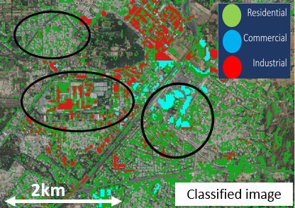

 
 
 We develop and exploit environmental remote sensing and geospatial techniques for investigating human-environment interactions pertaining to the nexus of land-use activities, environment and human impacts. We investigate driving mechanisms of land-use change and consequence of land-use changes on the environment. This involves characterizing spatio-temporal urban-rural land-use morphology, developing dynamic top-down and bottom-up air pollution emission inventories, and assessing human health impacts as shown in below.  
 Our research spans multiple data modalities such as space-borne optical and SAR sensors, UAV-borne sensors, low-cost air quality monitoring sensors and social sensing with process-based models. A portion of research is also dedicated towards infrastructure monitoring. 

   

 Research Directions:
1. Land-use change: Characteristics of volumetric urban growth, building functions as well as rural land-use change. How are these shaped by socio-economic drivers?
2. Environmental impact: Spatio-temporal variations of pollutants, trace gas concentrations and emissions? How physical land-processes regluate this? 
3. Health impacts: Environmental and socio-economic factors influencing individual exposure and vulnerability? Modelling acute and chronic exposure/impacts by combining satellite and portable sensors measurements.
4. Infrastructure monitoring: What is the impact of environment on infrastructure health and safety?  

Direction 1. Characterizing urban-rural land-use changes 
===

    

 <!-- Direction 1 Urban land-use  -->
   
 

   <table width="100%">
   <tbody>
      <tr>
         <td width="40%"></td>
         <td width="60%" class="papertext">
            
<strong>Identification of Brick Kilns using Sentinel-2 Imagery</strong>

            <a href="https://www.mdpi.com/2220-9964/9/9/544">[Misra et al. 2020 ISPRS IJGI]</a>
            <a href="https://timesofindia.indiatimes.com/city/delhi/study-tries-to-assess-brick-kilns-impact-on-air/articleshow/79711115.cms">[Media coverage, Time of India]</a>
         </td>
      </tr>
      <tr>
         <td width="40%"></td>
         <td width="60%" class="papertext">
            
<strong>Digital Building Height extraction from open Digital Surface Models</strong>

            <a href="https://www.mdpi.com/2072-4292/10/12/2008">[Misra et al. 2018 Remote Sens.]</a>
            <a href="https://github.com/mprakhar/DSM2DTM">[Github]</a>
            <a href="https://prakhar.users.earthengine.app/view/urban-morphology---ludhiana">[GEE App]</a>
         </td>
      </tr>
      <tr>
         <td width="40%"></td>
         <td width="60%" class="papertext">
            
<strong>Mapping Urban Land-use using Building Height and Nighttime Light</strong>

            <a href="https://www.researchgate.net/publication/333916547_A_NOVEL_TECHNIQUE_FOR_ESTIMATING_EXPANSION_OF_RESIDENTIAL_COMMERCIAL_AND_INDUSTRIAL_REGIONS_IN_INDIAN_MEGACITIES">[ResearchGate]</a> <a href="https://prakhar.users.earthengine.app/view/urban-morphology---ludhiana">[GEE]</a>
         </td>
      </tr>
      <tr>
         <td width="40%"></td>
         <td width="60%" class="papertext">
            
<strong>Building-density and Urban Heat Island</strong>

            <a href="https://www.mdpi.com/2072-4292/12/7/1191">[Rahman et al 2020 Remote Sens.]</a>
         </td>
      </tr>
      <tr>
         <td width="40%"></td>
         <td width="60%" class="papertext">
            
<strong>Identification of Rice-crop Calendar </strong>

            <a href="https://www.mdpi.com/2220-9964/8/5/211">[Minh et al. 2019 ISPRS IJGI]</a>
         </td>
      </tr>
      <tr>
         <td width="40%"></td>
         <td width="60%" class="papertext">
            
<strong> Identification of Conformity of Urban Land-use to Zoning Regulations </strong>

            <a href="https://link.springer.com/article/10.1007%2Fs11625-021-00923-0">[Rahman et al. 2021 Sust. Sci.]</a>
         </td>
      </tr>
   </tbody>
 </table> 
 

Direction 2. Modelling bottom-up and top-down environmental impacts
===

<!-- Direction 2 Environmental impacts  -->
   
 

   <table width="100%">
   <tbody>
      <tr>
         <td width="40%"></td>
         <td width="60%" class="papertext">
            
<strong>Top-down NOx Emission estimation with special focus on COVID-locakdown </strong>

            <a href="https://www.nature.com/articles/s41598-021-87673-2">[Misra et al. 2021 Nat. Sci. Rep.]</a>
            <a href="https://phys.org/news/2021-06-natural-anthropogenic-pollutants-air.html">[Media coverage, phys.org]</a>
         </td>
      </tr>
      <tr>
         <td width="40%"></td>
         <td width="60%" class="papertext">
            
<strong>Urban Air Quality (PM2.5) Indicator using Aerosol Optical Depth and Angstrom Exponent </strong>

            <a href="http://www.mdpi.com/2072-4292/9/8/851">[Misra et al. 2017 Remote Sens.]</a>
         </td>
      </tr>
      <tr>
         <td width="40%"></td>
         <td width="60%" class="papertext">
            
<strong>Contribution of Changing Land-use to Urban Air Pollution </strong>

            <a href="https://link.springer.com/article/10.1007%2Fs11625-021-00923-0">[Misra et al. 2018 Atmosphere]</a>
         </td>
      </tr>
      <tr>
         <td width="40%"></td>
         <td width="60%" class="papertext">
            
<strong>Contribution of Changing Land-use to Urban Air Pollution </strong>

            <a href="https://acp.copernicus.org/articles/21/2795/2021/">[Trang et al. 2021 Atmos. Chem. & Phy.]</a>
         </td>
      </tr>
      <tr>
         <td width="40%"></td>
         <td width="60%" class="papertext">
            
<strong>Remote sensing based KBDI Meteorological Drought Index </strong>

            <a href="https://prakhar.users.earthengine.app/view/kbdithailand">[GEE app]</a>
         </td>
      </tr>
   </tbody>
 </table> 
 

Direction 3. Mapping human exposure and health risk
===

 <!-- Direction 3 Health impacts  -->
   
 

   <table width="100%">
   <tbody>
      <tr>
         <td width="40%"></td>
         <td width="60%" class="papertext">
            
<strong>PM2.5 personal exposure mapping using portable low-cost sensors </strong>

            <a href="./document/Mapping PM2.5 in Indian cities handout.pdf">[Presentation]</a>
         </td>
      </tr>
      <tr>
         <td width="40%"></td>
         <td width="60%" class="papertext">
            
<strong>Social sensing resident interest in air quality and health impacts across Asian cities </strong>

            <a href="https://edcintl.cr.usgs.gov/downloads/sciweb1/shared/co/nli_pecora/pecora_21/manuscript_proceedings/Assessing_Population_Sensitivity_to_Urban_Air_Pollution.pdf">[Misra & Takeuchi 2020 Int. Arch. PRSSIS]</a>
            <a href="https://opac.ll.chiba-u.jp/da/curator/109294/BA64563608-22-P037.pdf">[Presentation]</a>
         </td>
      </tr>
   </tbody>
 </table> 
 

Direction 4. Infrastructure health monitoring
===

 
<!-- Direction 4 Infrastructure health  -->

 

<table width="100%" border="0">
    <tbody>
        <tr>
            <td width="32%"></td>            
            <td width="68%">
<strong>
            Estimating bridge construction year using NDWI </strong> 
            Eam Sovisoth, Vikas Kuntal,  <strong>Prakhar Misra</strong>, Wataru Takeuchi, Kohei Nagai 
            <a href="https://www.mdpi.com/2412-3811/8/4/77#">[Paper]</a> 
</td>
            <td>&nbsp;</td>
        </tr>
        <tr>
            <td width="32%"></td>            
            <td width="68%">
<strong>
            Detecting precursor onset of acceleration and time of failure in PS point time series using saliency and inverse velocity </strong> 
            Rishabh Chavhan, <strong>Prakhar Misra</strong>, Yu Morishita, Abhi Arya 
            <a href="https://2023.ieeeigarss.org/view_paper.php?PaperNum=3858#top">[IGARSS 2023]</a> 
</td>
            <td>&nbsp;</td>
        </tr>
    </tbody></table> 
   