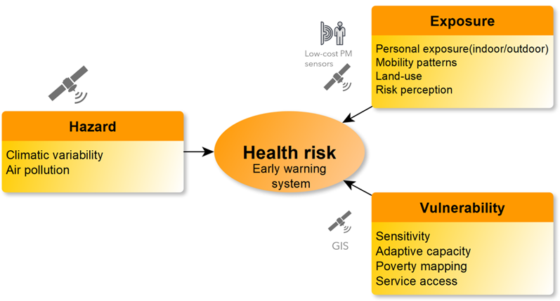

 
 
 At the **GeoHUES lab** we develop and exploit environmental remote sensing and geospatial techniques for investigating human-environment interactions pertaining to the nexus of land-use activities, environment and human impacts. We investigate driving mechanisms of land-use change and consequence of land-use changes on the environment. This involves characterizing spatio-temporal urban-rural land-use morphology, developing dynamic top-down and bottom-up air pollution emission inventories, and assessing human health impacts as shown in Figure 1. 

 
 
 
 Our work spans multiple data modalities such as space-borne optical and SAR sensors, UAV-borne sensors, low-cost air quality monitoring sensors and social sensing with process-based models. We have three main research directions:
1. What are the characteristics of volumetric urban growth, building functions as well as rural land-use change? How are these shaped by socio-economic drivers?
2. What are the variations of fine aerosol and trace gas concentrations and emissions over spatial scales ranging from urban/rural to regional, and temporally from diurnal to seasonal? How do physical land-processes determine tropospheric composition and air quality? 
3. What environmental and socio-economic factors influence individual exposure and vulnerability? How can we model individual acute and chronic exposure and impacts by combining satellite and portable sensors measurements?

Direction 1. Characterizing urban-rural land-use morphological changes 
===
 

Direction 2. Modelling bottom-up land-use impact and top-down emissions
===
 

Direction 3. Geoinformatics for health impacts through mapping human exposure and health risk
===
 

